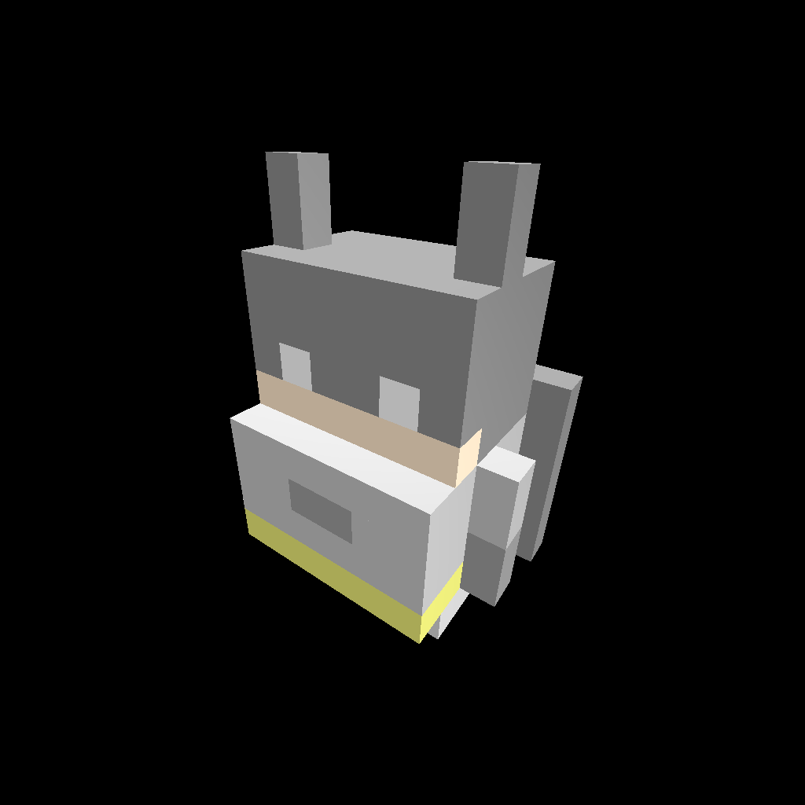

What is this?
=============

This is a port of parts of the C++ [PolyVox](http://www.volumesoffun.com/polyvox-about/) library to Rust

What does it do?
================

Given a volume of voxels it produces an optimised mesh for rendering with anything that can draw triangles in 3d.
This library does not do any rendering itself, that part is up to you.

The library also includes a command line tool to transform vox files into a JSON representation of the polygons needed to render the models contained in the vox file.
 
Can I see it in action?
=======================

Yes! Run one of the examples:

* ```cargo run --example simple```
    
    lights up a small group of voxels and renders them in 3d
     
* ```cargo run --example model```

    renders an example vox file exported from [MagicaVoxel](https://ephtracy.github.io/)
    
    